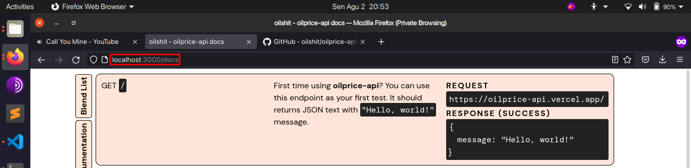

# oilprice-api

## Project Overview
This project displays basic API to get oil and gas prices based on oilprice.com.

## Requirements
- Node.js (you can download it [here](https://nodejs.org))

## Project Setup
Using **Terminal** (Linux and MacOS) or **WSL console** (Windows), you can clone this repository by
```bash
git clone https://github.com/oilshit/oilprice-api.git
cd oilprice-api
```

Assuming Node.js installation has been done, you can install project dependencies by
```bash
npm install
```
or
```bash
yarn
```

After installing dependencies, you can start the server by
```bash
npm run dev
```
or
```bash
yarn run dev
```

This will starts localhost server in `http://localhost:3000` (port 3000). You can access the API for the first testing by typing `http://localhost:3000` in your browser. The documentation of API can be accessed in `http://localhost:3000/docs`.

